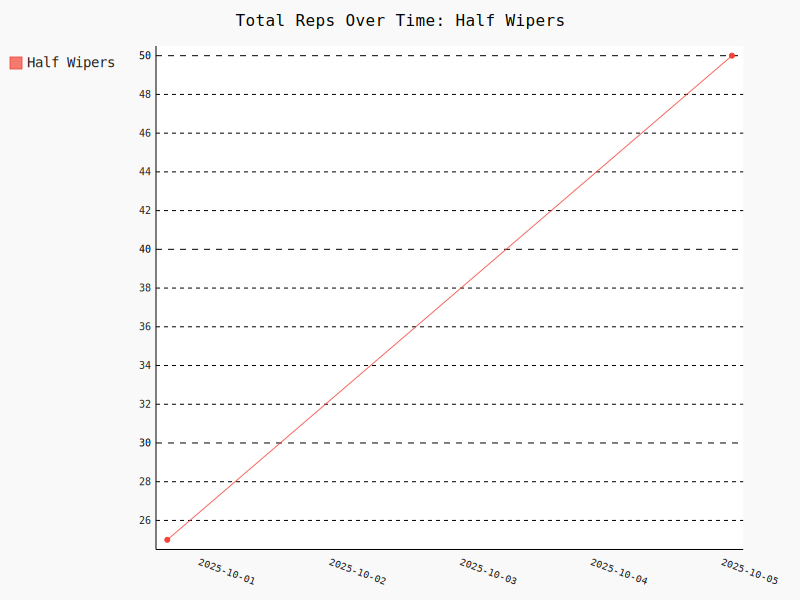
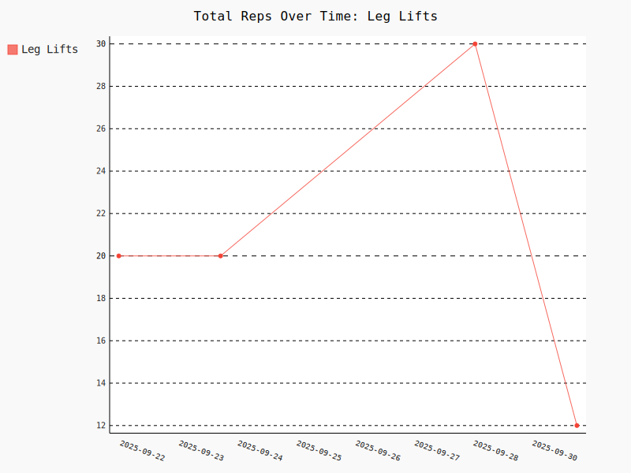
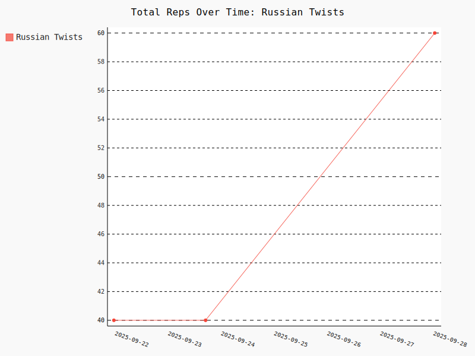
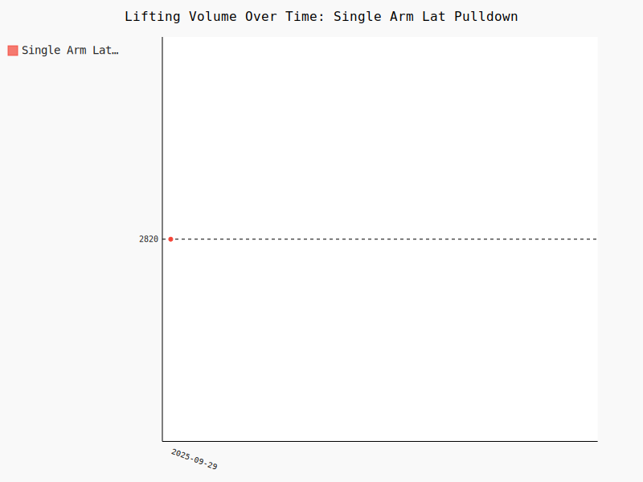
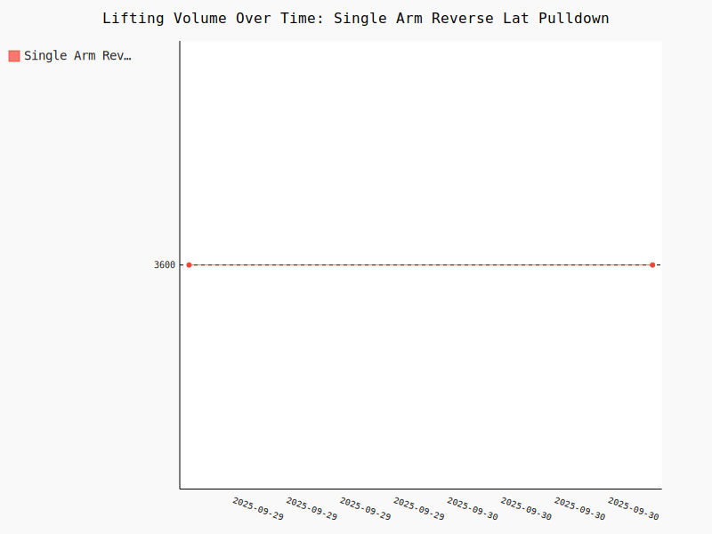
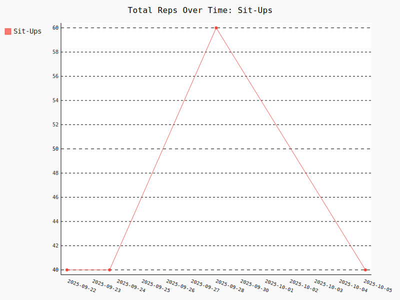
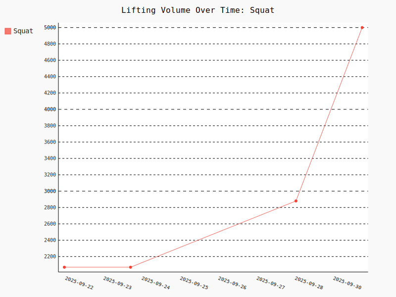
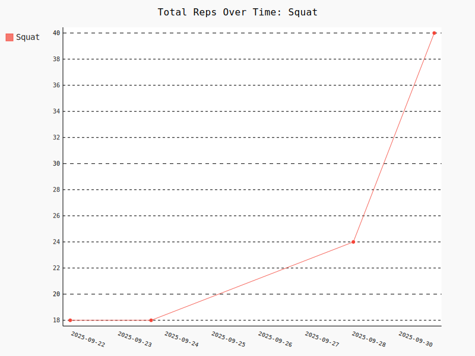

# Gym Tracker
Data analysis and visualizations for the gym. 

## Data

### Data Collection
For collecting data, it's recommended to create a Google Sheet/Excel Sheet with a tab for a gym log and a tab for exercises.
Those sheets can be exported or downloaded into the following files:

`exercises.csv`:
```
name,parent_exercise,muscle_groups,description,form_notes
Squat,,"Legs, Back",,"Toes slightly out, move butt back first, tighten core and fight the back trying to bend over forward."
Overhead Press,,"Shoulders, Back",,
Military Press,Overhead Press,"Shoulders, Back",Overhead press but with feet pressed together.,"At full extension, lean head forward a little and hold. Move consistently and purposefully thorughout the movement."
Lat Pulldown,,Back,,
...
```

`input/data.csv`:
```
date,exercise,reps,weight,notes
2025-09-29,Squat,6,95,
2025-09-29,Squat,6,115,
2025-09-29,Squat,6,135,
2025-09-29,Squat,6,135,feeling good
2025-09-29,Military Press,10,60,
2025-09-29,Military Press,10,60,
...
```

## Examples
I'm checking in my own workout data as an example.

The below are auto-generated charts created with a Github Workflow.

<!-- CHARTS_TABLE_START -->
<table>
<tr><th>Exercise</th><th>Volume (total lbs)</th><th>Reps</th><th>Weight Stats (lbs)</th></tr>
<tr><td>Back Extension</td><td></td><td></td><td></td></tr>
<tr><td>Bench Press</td><td></td><td></td><td></td></tr>
<tr><td>Dumbbell Bench Press</td><td></td><td></td><td></td></tr>
<tr><td>Dumbbell Chest Fly</td><td></td><td></td><td></td></tr>
<tr><td>Half Wipers</td><td></td><td></td><td></td></tr>
<tr><td>High Crunches</td><td></td><td></td><td></td></tr>
<tr><td>Leg Lifts</td><td></td><td></td><td></td></tr>
<tr><td>Military Press</td><td></td><td></td><td></td></tr>
<tr><td>Russian Twists</td><td></td><td></td><td></td></tr>
<tr><td>Single Arm Lat Pulldown</td><td></td><td></td><td></td></tr>
<tr><td>Single Arm Reverse Lat Pulldown</td><td></td><td></td><td></td></tr>
<tr><td>Sit Ups</td><td></td><td></td><td></td></tr>
<tr><td>Sitting Punches</td><td></td><td></td><td></td></tr>
<tr><td>Squat</td><td></td><td></td><td></td></tr>
<tr><td>Star Plank</td><td></td><td></td><td></td></tr>
<tr><td>V With Rotations</td><td></td><td></td><td></td></tr>
</table>
<!-- CHARTS_TABLE_END -->

## Build/Run
Built using `uv` (this project was a way for me to practice using it)

### Running Locally
This repo will run the following steps automatically when a commit is made via a Github Workflow.
```
uv run main.py
uv run generate_readme_table.py
```


### Relevant uv Commands
```
uv run <script or comand>
uv init
uv add
uv remove
uv sync
uv lock
```

